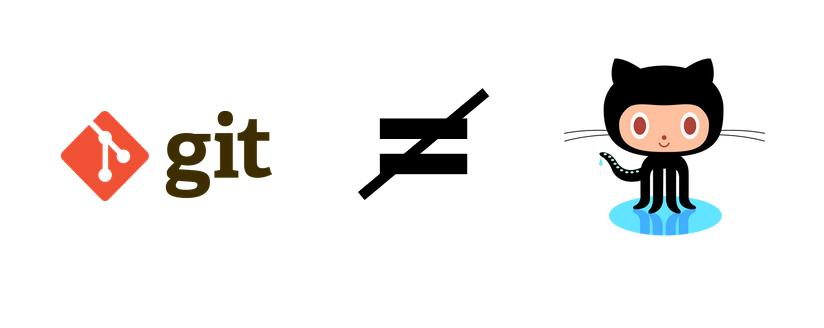
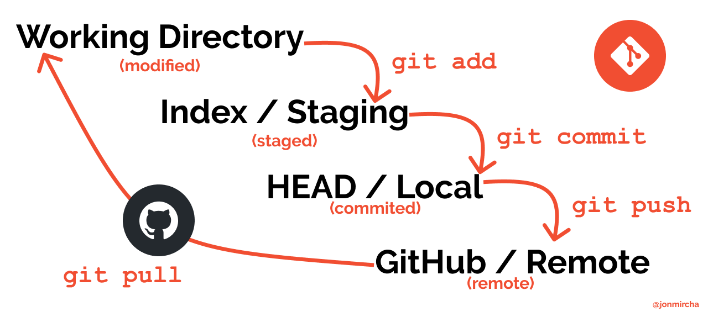

# GIT

Temes
---

- [GIT](#git)
  - [Temes](#temes)
  - [Introducció](#introducció)
    - [Instal·lació:](#installació)
    - [Plataformes _web_ que treballen amb _Git_ :](#plataformes-web-que-treballen-amb-git-)
  - [Configuració inicial](#configuració-inicial)
    - [Configurant _Git_ per primera vegada](#configurant-git-per-primera-vegada)
    - [Inicialitzar _Git_ en un directori local](#inicialitzar-git-en-un-directori-local)
  - [Flux bàsic](#flux-bàsic)
  - [De _màster_ a _main_](#de-màster-a-main)
    - [Per a repositoris nous](#per-a-repositoris-nous)
    - [Per a repositoris existents](#per-a-repositoris-existents)
    - [Per reemplaçar la branca _master_ per _main_ a _GitHub_](#per-reemplaçar-la-branca-master-per-main-a-github)
    - [Per a reemplaçar la rama _master_ per _main_ en _Git_](#per-a-reemplaçar-la-rama-master-per-main-en-git)
  - [Ajuda](#ajuda)
  - [Ignorar arxius](#ignorar-arxius)
  - [Clonar repositoris](#clonar-repositoris)
  - [Branques](#branques)
  - [Fusions](#fusions)
  - [Canvis](#canvis)
  - [Registre de l'historial](#registre-de-lhistorial)
  - [Reinicialitzo de l'historial](#reinicialitzo-de-lhistorial)
  - [Reinicialitzar un repositori](#reinicialitzar-un-repositori)
  - [Remots](#remots)
  - [Etiquetes](#etiquetes)
  - [_GitHub Pages_](#github-pages)
  - [Colaboració a _GitHub_](#colaboració-a-github)
  - [Aprèn més](#aprèn-més)

---

Introducció
-----------

[_Git_](https://git-scm.com/) és un _programari_ de control de versions distribuït i descentralitzat que permet a un equip de desenvolupadors treballar sobre el mateix codi.

S'anomena **distribuït** perquè cada membre de l'equip té una còpia completa del codi.

Els membres de l'equip poden enviar-se codi, rebre'l i desenvolupar funcionalitats de manera conjunta i separada del servidor central.

Algunes ventajas de fer-lo servir:

*   És l'estàndard actual.
*   Codi col·laboratiu, versionat i distribuït.
*   Recuperació de fitxers.
*   Major control.
*   _Shorcuts_ i _plugins_ .
*   Millora la productivitat.

### Instal·lació:

*   [_Git_](https://git-scm.com/downloads).
*   Interfícies gràfiques:
    *   [_Source Tree_](https://www.sourcetreeapp.com/).
    *   [_GitHub Desktop_](https://desktop.github.com/).
    *   [_GitKraken_](https://www.gitkraken.com/) .
    *   [_Visual Studio Code_](https://code.visualstudio.com/%23built-in-git).
    *   etc.

### Plataformes _web_ que treballen amb _Git_ :

*   [_GitHub_](https://github.com/) .
*   [_GitLab_](https://gitlab.com/).
*   [_BitBucket_](https://bitbucket.org/).
*   etc.

[🔼 Tornar](#temes).

* * *

Configuració inicial
--------------------

### Configurant _Git_ per primera vegada

    git --version
    git config --global user.name "Anscari Torrecilla"
    git config --global user.email anscaritorrecilla@gmail.com
    git config --global user.ui true
    git config --global init.defaultBranch main
    git config --list
    # assignant vscode com a editor de configuració de git
    git config --global core.editor "code --wait"
    git config --global -e
    # para estandarizar los saltos de línea en windows
    git config --global core.autocrlf true
    # para estandarizar los saltos de línea en linux/mac
    git config --global core.autocrlf input
    # ver todas las opciones de la configuración en la terminal
    git config -h
    # ver todas las opciones de la configuración en el navegador
    git help config

### Inicialitzar _Git_ en un directori local

    mkdir carpeta
    cd carpeta
    touch README.md
    touch .gitignore
    git init
    code .

[🔼 Tornar](#temes)

* * *

Flux bàsic
----------

El flux de _Git_ consta de tres estats locals, és a dir a l'ordinador on s'està treballant i un més de forma remota quan accedim al codi centralitzat en plataformes com _GitHub_ , _Gitlab_ , _Bitbucket_ , etc.

Aquests estats són **_modified_** , **_staged_** , **_committed_** i **_remote_** .  

 A cadascuna li correspon una àrea de treball:

1.  **_Working Directory_** : És l'àrea corresponent a l'estat **_modified_** i és la carpeta local del teu ordinador on emmagatzemis els fitxers del teu projecte.
2.  **_Staging Area_** : És l'àrea corresponent a l'estat **_staged_** també s'anomena **_index_** perquè és l'àrea on _git_ indexa i afegeix els canvis realitzats als fitxers previs a comprometre'ls al seu registre.
3.  **_Local Repository_** : És l'àrea corresponent a l'estat **_committed_** , on els canvis ja s'han registrat al repositori de _git_ també s'anomena **_HEAD_** perquè indica en quin canvi es troba el punter del repositori.
4.  **_Remote Repository_** : És l'àrea corresponent a l'estat **_remot_** i és el directori remot on emmagatzemem els fitxers del projecte en alguna plataforma _web_ com _GitHub_ , _GitLab_ , _BitBucket_ . _Git_ anomena **_origin_** el repositori remot.

    #agregar els canvis d'un arxiu al staged  
    git add arxiu/directori  

    #agregar tots els canvis de tots els arxius al staged  
    git add .  

    #els canvis són compromesos en el repositori.  
    #has d'escriure el missatge del canvi quan s'obri l'arxiu de configuració, en acabar guarda i tanca l'arxiu perquè tinguin efecte.  
    git commit 

    #és un shortcut del comando anterior, escrius i confirmes el missatge del canvi en un pas  
    git commit -m "missatge descriptiu del canvi"
    
    #s'agrega l'origen remot del teu repositori de GitHub  
    git remalnom add origin https://github.com/usuari/repositori.git 

    #la primera vegada que vinculem el repositori remot amb el local  
    git push -o origin main

    #per a les subseqüents actualitzacions, si nó canvies de branca  
    git push
    
    #per a descarregar els canvis del repositori remot al local  
    git pull

[🔼 Tornar](#temes)

* * *

De _màster_ a _main_
--------------------

Amb els desafortunats esdeveniments del 25 de maig de 2020 als Estats Units que van culminar amb l'assassinat de l'afroamericà [_George Floyd_](https://es.wikipedia.org/wiki/Muerte_de_George_Floyd) a mans de policies de la ciutat de _Mineàpolis_ , es va intensificar de manera global el moviment [_#BlackLivesMatter_](https://es.wikipedia.org/wiki/Black_Lives_Matter) .

Amb aquest moviment moltes indústries i empreses van començar a prendre accions per erradicar el racisme.

A la indústria de la tecnologia per anys s'han emprat paraules com _master_ , _slave_ , _whitelist_ , _blacklist_ entre d'altres que actualment no són ben vistes pel context i la semàntica que impliquin.

Sobre això _Microsoft_ empresa propietaria de _GitHub_ va decidir començar una campanya per reemplaçar el nom de la branca principal dels repositoris de _màster_ a _main_ ; com ho han explicat en aquest [document](https://github.com/github/renaming) :

> "L'1 d'octubre de 2020, qualsevol nou repositori que creïs utilitzarà ' _main_ ' com la rama per defecte, en lloc de ' _master_ '. Aquest canvi no afecta cap dels teus repositoris existents: els repositoris existents continuaran tenint la mateixa rama per defecte que tenen ara”.

Aquest canvi implica afegir un parell de línies d'ordres addicionals per crear la branca ' _main_ ' i fer-la principal al repositori. El flux bàsic quedarà de la següent manera:

### Per a repositoris nous

    git init
    git add .
    git commit -m "Primer commit"
    git branch -M main
    git remote add origin https://github.com/usuari/repositori.git
    git push -u origin main

### Per a repositoris existents

    git branch -M main
    git remote add origin https://github.com/usuari/repositori.git
    git push -u origin main

### Per reemplaçar la branca _master_ per _main_ a _GitHub_ 

    #Pas 1
    #Crea la branca local main i passa-li l'historial de la branca màster
    git branch -m master main
    
    
    #Pas 2  
    #Fes un push de la nova branca local main    en el repositori remot de GitHub  
    git push -u origin main
    
    
    #Pas 3
    #Canvia el HEAD actual a la branca main
    git symbolic-ref refs/remotes/origin/HEAD refs/remotes/origin/main

    #Pas 4
    #Canvia la branca _default_ de _màster_ a _main_ en el teu repositori de _GitHub_ .

Per a fer-ho, segueix les instruccions d'aquest [enllaç](https://docs.github.com/en/github/administering-a-repository/setting-the-default-branch).

    # Pas 5
    #Elimina la branca màster del repositori remot
    git push origin --delete master

### Per a reemplaçar la rama _master_ per _main_ en _Git_

    git config --global init.defaultBranch main

[🔼 Tornar](#temes)

* * *

Ajuda
-----

    #ajuda en la terminal
    git comando -h
    #ajuda en el navegador
    git help comando

[🔼 Tornar](#temes)

* * *

Ignorar arxius
----------------

En l'arxiu **_`.gitignore`_** incloem tot el que **NO** vulguem incloure en el nostre repositori. Ho podem crear manualment o amb [_gitignore.io_](https://www.gitignore.io/).

    #Comentari
    arxiu.ext
    carpeta
        /arxiu_des d'arrel.ext

    #ignorar tots els arxius que acabin en .log
    .log

    #excepte production.log
    !production.log

    #ignorar els arxius acabats en .txt dins de la carpeta doc.

    #però no en les seves subcarpetas
    doc/*.txt

    #ignorar tots els arxius acabats en .txt dins de la carpeta doc

    #i també en les seves subcarpetas
    doc/**/*.txt

[🔼 Tornar](#temes)

* * *

Clonar repositoris
-------------------

    git clone https://github.com/usuari/repositori.git

[🔼 Tornar](#temes)

* * *

Branques
-----

Una branca ens permet aïllar una nova funcionalitat en el nostre codi que després podrem afegir a la versió principal.

    #crear branca
    git branch nom-branca

    #canviar de branca
    git checkout nom-branca

    #crear una branca i canviar-te a ella
    git checkout -b branca

    #eliminar branca
    git branch -d nom-branca

    #eliminar branques remotes
    git push origin --delete nom-branca

    #eliminar branca (forçat)
    git branch -D nom-branca

    #llistar totes les branques del repositori
    git branch

    #llistar les branques no fusionades a la branca actual
    git branch --no-merged

    #llesta branques fusionades a la branca actual
    git branch --merged

    #depassar branques
    git checkout branca-secundària
    git depassi branca-principal

[🔼 Tornar](#temes)

* * *

Fusions
--------

Uneix dues branques. Per a fer una fusió necessitem:

1. Situar-nos en la branca que es quedarà amb el contingut fusionat.
2. Fusionar.
Quan es fusionen branques es poden donar 2 resultats diferents:

* *_*Fast-*Forward_**: La fusió es fa automàtica, no hi ha conflictes per resoldre.
* *_Manual Merge_**: La fusió cal fer-la manual, per a resoldre conflictes de duplicació de contingut.

        #ens canviem a la branca principal que quedarà de la fusió  
        git checkout branca-principal

        #executem el comando merge amb la branca secundària a fusionar  
        git merge branca-secundària

[🔼 Tornar](#temes)

* * *

Canvis
-------

Pots agregar modificacions a l'últim canvi

    #sense editar el missatge de l'últim commit  
    git commit --amend --no-edit

    #editant el missatge de l'últim commit  
    git commit --amend -m "nou missatge per a l'últim commit"

    #eliminar l'últim commit  
    git reset --hard HEAD~1

    Podem desplaçar-nos en l'historial del repositori cap endarrere o avanci en canvis o branques , sense afectar el repositori com a tal.

    #canviar a una branca   
    git checkout nom-branca

    #canviar a un commit en particular  
        git checkout id-commit

[🔼 Tornar](#temes)

* * *

Registre de l'historial
----------------------

**`*git *log`** ens permet conèixer tot l'historial d'un projecte, amb la informació de la data, l'autor i aneu de cada canvi.

 git log
 
    #mostra en una sola línia per canvi  
    git log --oneline
    
    #guarda el log en la ruta i arxiu que especifiquem  
    git log > commits.txt
    
    #mostra l'historial amb el format que indiquem  
    git log --pretty=format:"%h - %an, %ar : %s"
    
    #canviem la n per qualsevol nombre enter i mostrarà els n canvis recents  
    git log -n
    
    #mostra els canvis realitzats després de la data especificada  
    git log --after="2019-07-07 00.00:00"
    
    #mostra els canvis realitzats abans de la data especificada  
    git log --before="2019-07-08 00.00:00"
    
    #mostra els canvis realitzats en el rang de data especificat  
    git log --after="2019-07-07 00.00:00" --before="2019-07-08 00.00:00"
    
    #mostra una gràfica de l'historial de canvis, branca i fusions  
    git log --oneline --graph --all
    
    #mostra tot el registre d'accions del log
    #incloent insercions, canvis, eliminacions, fusions, etc.  
    git reflog
    
    #diferències entre el Working Directory i el Staging Area
    git diff

[🔼 Tornar](#temes)

* * *

Reinicialitzo de l'historial
---------------------

Podem eliminar l'historial de canvis del projecte cap endavant respecte a un punt de referència.

    #ens mostra el llistat d'arxius nous (untracked), esborrats o editats
    git estatus
    
    #esborra HEAD
    git reset --soft
    
    #esborra HEAD i Staging
    git reset --mixed
    
    #esborra tot: HEAD, Staging i Working Directory
    git reset --hard
    
    #desfà tots els canvis després del *commit indicat, preservant els canvis localment
    git reset aneu-commit
    
    #rebutja tot l'historial i torna al commit especificat
        git reset --hard id-commit

[🔼 Tornar](#temes)

* * *

Reinicialitzar un repositori
-----------------------

Si en algun moment tens la necessitat de reinicialitzar l'historial de canvis d'un repositori perquè quedi com si l'acabaràs de crear executa aquesta sèrie de comandos:

    cd carpeta-repositori
    mv .git/config ~/saved_git_config
    rm -rf .git
    git init
    git branch -M main
    git add .
    git commit -m "Commit inicial"
    mv ~/saved_git_config .git/config
    git push --force origin main

[🔼 Tornar](#temes)

* * *

Remots
-------

    #mostra els orígens remots del repositori  
    git remalnom

    #mostra els orígens remots amb detall  
    git remalnom -v

    #agregar un orígen remot  
    git remalnom add nom-orígen https://github.com/usuario/repositori.git

    #canviar de nom un orígen remot  
    git remalnom rename nom-vell nom-nou

    #eliminar un orígen remot
    git remalnom remove nom-orígen

    #descarregar una branca remota a local diferent de la principal
    git checkout --track -b branca-remota origin/branca-remota

[🔼 Tornar](#temes)

* * *

Etiquetes
---------

Amb aquesta opció _git_ ens permet versionar el nostre codi, llibreria o projecte.

    #llistar etiquetes
    git tag
    
    crear una etiqueta
    git tag numero-versió
    
    #eliminar una etiqueta
    git tag -d numero-versió
    
    #mostrar informació d'una etiqueta
    git xou numero-versió
    
    #sincronitzant l'etiqueta del repositori local al remot
        git add .
        git  tag v1.0.0
        git commit -m "v1.0.0"
        git push origin número-versió
        
        #generant una etiqueta anotada (amb missatge de commit)
        git add .
        git tag -a "v1.0.0" -m "Missatge de l'etiqueta"
        git push --tags

[🔼 Tornar](#temes)

* * *

_GitHub Pages_
--------------

[**`gh-pages`**](https://pages.github.com/) és una branca especial per a crear un lloc _web_ al teu projecte allotjat directament en el teu repositori de _GitHub_.

* _URL_ del repositori: **[https://github.com/usuario/repositori](https://github.com/usuario/repositorio)**
* _URL_ del lloc: **[https://usuario.github.io/repositori](https://usuario.github.io/repositorio)**

Per crear aquesta branca especial en _GitHub_ executem els següents comandos:

    git branch gh-pages
    git checkout gh-pages
    
    git remote add origin https://github.com/usuario/repositorio.git
    git push origin gh-pages
    
    #per a descarregar els canvis del repositori remot al local
    git pull origin gh-pages

[🔼 Tornar](#temes)

* * *

Colaboració a _GitHub_
------------------------

Per poder col·laborar en projectes allotjats en _GitHub_ necessitem fer ús dels _forks_ i _pull requests_, eines que ens ofereix la plataforma per a aquest objectiu.

A continuació descric el procés de col·laboració en _GitHub_.

1. _Forkea_ el repositori en el qual vulguis col·laborar, per a fer-lo, segueix les instruccions d'aquest [enllaç](https://docs.github.com/en/get-started/quickstart/fork-a-repo).
2. Una vegada _forkeat_ el repositori en el teu compte de _GitHub_, clona'l en el teu equip de còmput.
3. En el repositori local cal configurar els orígens remots de la teva nova copía per a tenir tots dos remots, els originals (_origin_) i els de la teva còpia, per a fer-ho, segueix les instruccions d'aquest [enllaç](https://docs.github.com/en/pull-requests/collaborating-with-pull-requests/working-with-forks/configuring-a-remote-for-a-fork).
4. Crea una branca nova en la teva _fork_ local per a fer la teva col·laboració, i sincrónizala amb el teu repositori remot, per a fer-ho, segueix les instruccions d'aquest [enllaç](https://docs.github.com/en/pull-requests/collaborating-with-pull-requests/working-with-forks/syncing-a-fork).
5. Configura el teu repositori perquè vaig acceptar canvis (_pull requests_), per a fer-ho, segueix les instruccions d'aquest [enllaç](https://docs.github.com/en/pull-requests/collaborating-with-pull-requests/working-with-forks/allowing-changes-to-a-pull-request-branch-created-from-a-fork).
6. Crea una _pull request_, per a fer-ho, segueix les instruccions d'aquest [enllaç](https://docs.github.com/en/pull-requests/collaborating-with-pull-requests/proposing-changes-to-your-work-with-pull-requests/creating-a-pull-request).
7. Espera al fet que l'amo del repositori original, accepti els teus canvis.
8. Una vegada que acceptin la teva _pull request_, és recomanable que esborris la branca en la qual vas treballar el canvi i actualitzis el teu repositori _forkeado_, amb els canvis del repositori original.

Resum dels comandos a executar per a col·laborar en un repositori de _GitHub_:

    # forkear repositori
    git clone https://github.com/usuario/repositorio.git
    git remote -v
    git remote rename origin fork
    git remote add origin https://github.com/usuario/repositorio.git
    git checkout -b branca-nova
    git push fork branca-nova

    # sol·licitar el pull request
    # acceptar el pull request
    git checkout main
    git pull origin main
    git push fork main
    git branch -d branca-nova
    git push fork --delete branca-nova

[🔼 Tornar](#temes)

* * *

Aprèn més
-----------

A continuació et deixo alguns enllaços on pots aprofundir els teus coneixements sobre _Git_ i _GitHub_:

*   [_Git_ - la guia senzilla](http://rogerdudler.github.io/git-guide/index.es.html).
*   [Llibre _Pro Git_](https://git-scm.com/book/es).
*   [Guies oficials de _GitHub_](https://docs.github.com/es).

[🔼 Tornar](#temes)

* * *

